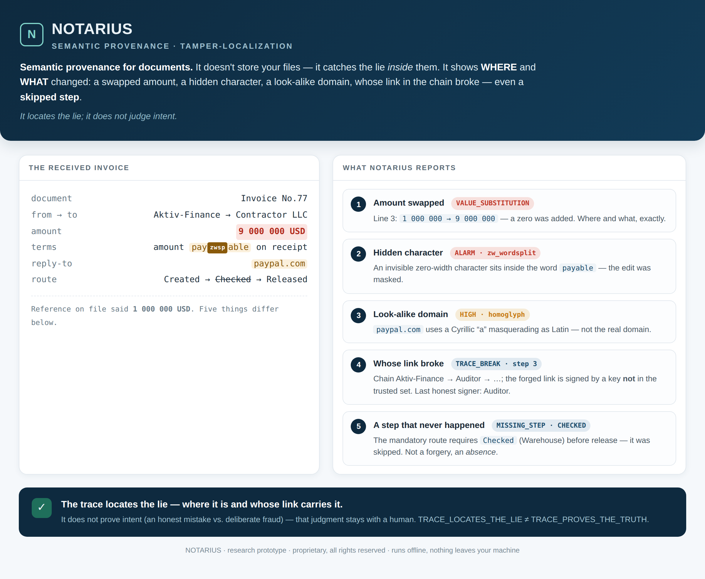
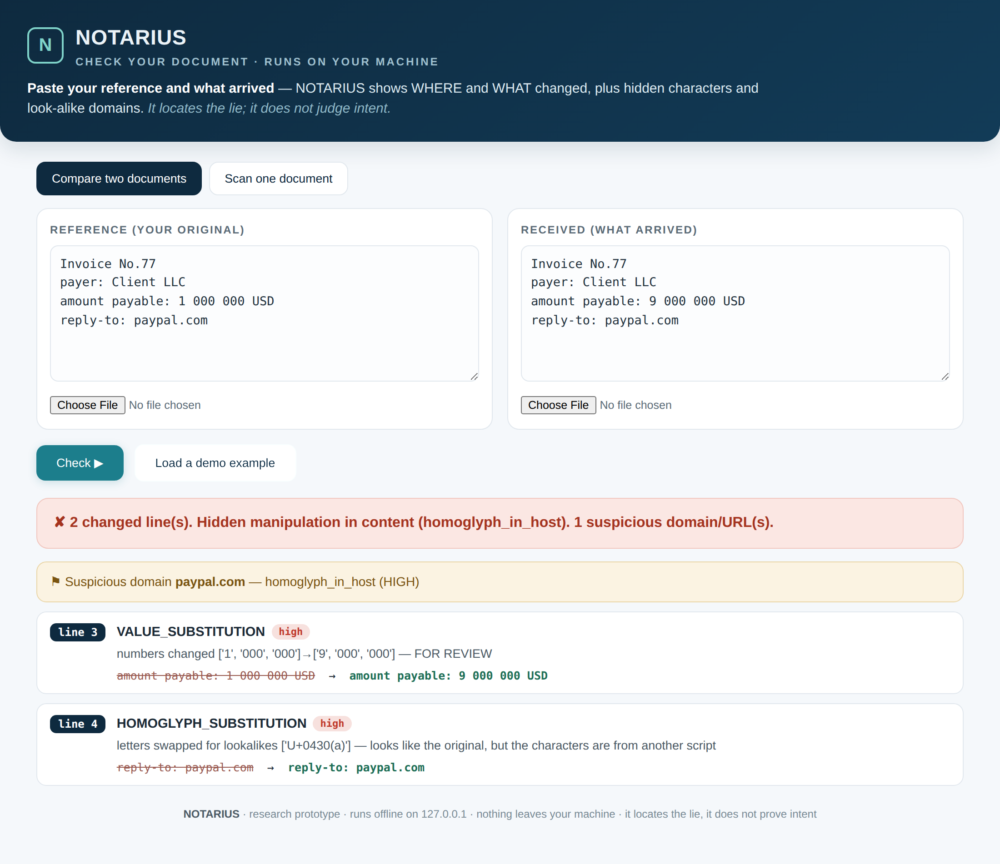

> ▶ **Live walkthrough** (click through it one finding at a time — open in any browser, runs offline):
> [`docs/product_mockup/notarius_presentation_live.html`](docs/product_mockup/notarius_presentation_live.html)
> · static one-screen version: [`notarius_presentation.html`](docs/product_mockup/notarius_presentation.html)

# NOTARIUS — working ground

Project author: Ruslan Malyavskiy.
Parent framework: **E-Continuity / Governed recoverability**
(AD-13; the ecosystem roof — docs/E_CONTINUITY_FRAMING_2026-07-22_EN.md).
NOTARIUS is a branch of it: recoverability of a data element's provenance.

NOTARIUS is a research hypothesis: a provenance tracker for data elements
(where an element came from, what it passed through, native vs inserted).
Current status: RESEARCH_TRACK (AD-9, 2026-07-22) — open research; the
product search is paused after the applications conveyor (40 ideas, 5 model
families, 0 STRONG). Main assets: filter-formulas, a prototype with negative
tests, a catalog of 7 structural defects of provenance ideas
(docs/conveyor_results/FINAL_APPLICATIONS_REPORT_2026-07-22_EN.md).

## Contents

- `docs/NOTARIUS_FULL_SESSION.md` — the original working compendium (2026-07-20).
- `docs/NOTARIUS_METHODOLOGICAL_AUDIT_2026-07-21_EN.md` — a line-by-line
  methodological audit of the compendium: verdicts per section, a register of
  internal contradictions, and the decisions required from the author.
- `notarius/witness.py` — v1: the naive length-witness from §6.3 (as a
  diagnostic) and the HMAC envelope (stdlib; demo only — HMAC does not prove
  anything to a third party).
- `notarius/envelope_v2.py` — v2: an Ed25519 envelope (PyNaCl) — closes
  defect #2 of the catalog; candidly does NOT close #1 (content
  self-attestation) or #3 (time self-declaration) — shown by tests.
- `notarius/trace.py` — **core: semantic tracing** (AD-19). A chain of signed
  element events (CREATED→TRANSFORMED→…→REVIEWED) with break detection and a
  human-readable §16 report (`TRACE_BREAK_DETECTED`, break step, last signer).
  **THE CANON (heart of the product):** `docs/SEMANTIC_TRACE_CANON_2026-07-23_EN.md`
  — the authoritative definition of semantic tracing, distilled from its
  origins (AD-39). Implementation walkthrough: `docs/SEMANTIC_TRACE_2026-07-22_EN.md`.
- `notarius/record.py` — **governed record** (AD-87): a living document where
  each field has its own **keeper** (numbers have their own), every edit is
  attributed (a signed editor event), the reader is shown a **footnote**
  "who / where / when", and an edit that bypasses the keeper or the trace is
  localized by field (EDIT_BY_NON_KEEPER / UNSIGNED_CHANGE / NEW_SLOT). It
  folds the sealed-void + legitimate-progression + field-keeper prototypes into
  one part of the core. It complements trace.py (there — the chain of an
  element's value; here — a field structure with zones of responsibility).
  Demo: `scripts/record_demo.py`.
- `notarius/route.py` — **mandatory route** (AD-92): checks a trace against a
  contract of required steps "type → responsible role" and catches what the
  chain cannot see — a MISSING step (silent omission, the one real gap of both
  external audits). It localizes: MISSING_STEP / WRONG_SIGNER (a self-signature
  does not pass) / OUT_OF_ORDER / CHAIN_BROKEN. A layer, not plumbing (AD-83):
  built from our own tracing. Boundary: it proves omission and role
  impersonation, not the physical truth of a step (SIGNED ≠ NATIVE). Probes:
  `tests/test_route.py`.
- `notarius/cosign.py` — **witness-cosigning** (AD-36): external witnesses
  co-sign the trace head after checking consistency (RFC 6962 /
  C2SP tlog-witness). Closes the one candidly-uncovered hole in the trace
  (fork/truncation, M4 from AD-22): a forked branch will not get a quorum, a
  truncated prefix will not match the witnessed head. It catches only if the
  verifier requires a quorum; the witness sees the head, not the truth
  (SIGNED ≠ NATIVE).
- `notarius/frost.py` — **FROST-ED25519** (AD-38): a reference threshold
  signature over libsodium primitives. The secret is NOT reassembled at
  signing time (removes custody.py's "seed in memory" boundary); the output is
  an ordinary Ed25519 signature accepted by an UNMODIFIED verify (AD-30).
  Candidly: reference, not production, not audited, not constant-time;
  production = Rust FROST via FFI. Proven by tests: 2-of-3 passes our verify,
  1 share does not.
- `notarius/scanner.py` — v2: a scanner of invisible codepoints with neighbor
  context (inside a word = HIGH, at a boundary = MEDIUM), an x-ray projection
  (`adm[U+FEFF]in`) and a LIKELY_LEGITIMATE class for variation selectors
  (C2PA 2.3 / emoji). Ideas from Gemini cross-material.
- `tests/` — 235 tests in 22 files (v1 HMAC + v2 Ed25519 + external-audit
  regressions), including negative ones: an executable record of both what is
  caught and what is NOT.
- `docs/conveyor_results/` — applications conveyor: 40 ideas from 5 model
  families, judge verdicts, a catalog of 7 structural defects; design-review §6.2.
- `docs/NOTARIUS_DISCIPLINE_2026-07-22_EN.md` — project discipline (AD-12):
  the FO-015 chain skeleton, the FO-035 concrete-object method, the
  FO-018 anti-cargo-cult guard (integrated from the Foundation Layer).
- `docs/foundation_layer/` + `FOUNDATION_LAYER_ANALYSIS_2026-07-22_EN.md` —
  the parent MSL/MIP project package and its methodological review.

## The working program: run it on YOUR OWN document (AD-64, AD-93)

Two front doors over one shared engine (`notarius/analyze.py`) — so the CLI and
the app can never disagree.

**Command line** — no keys, no installs, pure stdlib:
```
python3 -m notarius check REFERENCE RECEIVED   # where and what was swapped
python3 -m notarius seal  FILE                 # take a receipt-fingerprint (.ntr)
python3 -m notarius verify FILE                # is it the same, or touched
```

**Local web app** — a friendly window on the same engine:
```
python3 -m notarius web        # opens http://127.0.0.1:8788 in your browser
```
Paste your reference and what arrived (or drop two files), press Check, and get
the verdict in plain terms. It binds to `127.0.0.1` only — **local, offline,
nothing leaves your machine**. (The compare/scan path is pure stdlib; signing
needs PyNaCl.)



`check` shows, in plain terms, the line number, the change category (value
substitution / invisible char / homoglyph / loss / rewritten) and exposes hidden
edits and look-alike domains. The boundaries are candid: we show WHERE the lie
is, we do not pass a verdict on intent. A full worked scenario —
`scripts/handoff_demo.py`; the plain-language "what is this" —
`docs/DEMO_HANDOFF_ONEPAGER_2026-07-24_EN.md`.

## Signing / identification algorithms (AD-18)

`algorithms/` — signing and identification of segments OR the whole across
different carriers + confirmation, including non-standard ones:
- `merkle_segments.py` — sign the whole + inclusion-proof for any segment
  without the rest (removes the "segment is expensive / whole is mute" dilemma);
- `human_fingerprint.py` — a word-fingerprint (human cross-carrier check:
  stone ↔ screen ↔ voice) + a self-checking mod-97 ID + a redundant ID
  (survives partial damage).
A catalog of all methods (machine / human-verifiable / carrier-detector /
recoverability / exotic) with a "carrier × verifier" map:
`docs/ALGORITHMS_SIGNING_IDENTIFICATION_2026-07-22_EN.md`.

## Integrations of ready-made standards (AD-31)

`notarius/integrations.py` — real adapters (not stdlib; `pip install
reedsolo opentimestamps`):
- **Reed-Solomon** — carrier recovery under damage. Working, tested offline
  (`tests/test_integrations.py`): damage within budget is recovered, beyond it
  candidly is not.
- **OpenTimestamps** — trusted time (Bitcoin anchor). The adapter is real, but
  `ots_stamp()` needs the network (calendar) and `verify` needs a Bitcoin node;
  end-to-end was NOT verified in this environment (network is blocked).

How to wire it into our modules (opt-in, without changing the stdlib core):
```python
# durable carrier — wrap with RS parity:
from notarius.integrations import rs_protect, rs_recover
armored = rs_protect(carrier_bytes, parity=16)   # +16 bytes, fixes up to 8
carrier_bytes = rs_recover(armored, parity=16)   # survives a chip/smudge

# trace event — anchor the time (needs the network):
from notarius.integrations import ots_digest_of, ots_stamp, ots_serialize
ts = ots_stamp(ots_digest_of(canonical_event))   # → trace.anchor
event["anchor"] = ots_serialize(ts).hex()
```
Full plan — docs/INTEGRATION_DOSSIER_2026-07-23_EN.md.

## Detection layer from the sibling "Vakhter" (AD-33)

A line-by-line audit of the sibling project rus1978rus/vakhter@3763b71 (same
author) showed: it is a second branch of the same source — it has a mature
DETECTION layer, we have mature CRYPTO. We took their detection (a verbatim
port under our own tests) and kept our Ed25519 crypto. Review:
`docs/VAKHTER_AUDIT_2026-07-23_EN.md`.
- `notarius/canon.py` — a pre-pass against encoding evasion (percent/entity/
  `\u\x`/**overlong UTF-8**/numeric IP). ⚠️ NOT Unicode normalization; does NOT
  close AD-4 — it is orthogonal.
- `notarius/detect.py` — the engine: ALARM on smuggling (word-split, bidi
  imbalance CVE-2021-42574, tag-smuggling, VS-carrier, parser-desync), OK on
  legitimate joins (emoji-ZWJ etc.), WATCH on the unknown, fail-closed.
- `notarius/homoglyph.py` — a look-alike-character detector (Cyr./Grk.→Latin),
  AD-79. Closes a defect found by reviewer Kimi through execution: "аdmin"
  (Cyrillic "а") is now classified as `HOMOGLYPH_SUBSTITUTION` in diagnose, and
  `scan_hardened` returns ALARM `homoglyph_mixed_script` on a MIX of scripts
  inside a word (purely single-script text does not alarm).
- `notarius/scanner.py::scan_hardened()` — the facade: our v2 x-ray plus
  canonicalization, engine and homoglyphs on top. Advisory, blocks nothing.
```python
from notarius.scanner import scan_hardened
r = scan_hardened("admin&#8203;istrator")   # entity-hidden ZWSP inside a word
# r["risk"] == "ALARM", r["signature"] == "zw_wordsplit"
```
Boundary: a port of draft logic under our own tests (behavior, not
"security"); others' metrics are not accepted as validated.

## Package standard (E-Continuity governance, AD-15)

The repository is brought up to the parent's package standard:
- `docs/_package/PACKAGE_PROVENANCE_CARD.prov` — provenance passport;
- `docs/_package/DOCUMENT_PROVENANCE_REGISTER.md` — a card for every
  important document (ORIGIN: author source / AI output / vendor / copy);
- `docs/_package/STATUS_AND_LIMITATIONS_NOTE.txt` — status and boundaries;
- `docs/_package/MANIFEST.tsv` + `SHA256SUMS.txt` — real SHA-256;
- `scripts/gen_package.sh` — reproducible rebuild of the inventory and hashes.

Integrity check:
```
bash scripts/gen_package.sh                    # rebuild
sha256sum -c docs/_package/SHA256SUMS.txt      # verify
```
Boundaries (parent rules): `HASH_EXISTS ≠ HASH_VERIFIED` (hashes computed in
the environment, not externally verified); `LLM_OUTPUT ≠ VERIFIED_COPY`;
`COPY ≠ PROVENANCE`.

## Running the tests

```
python3 tests/test_witness.py   # v1 (stdlib only)
python3 tests/test_v2.py        # v2 (requires: pip install pynacl)
```

## License (AD-55)

**PROPRIETARY — ALL RIGHTS RESERVED** (`LICENSE`, AD-82). The repository is open
for VIEWING only (reference / transparency). No license or right is granted:
use, execution, copying, modification and distribution are by the author's
WRITTEN permission only. A deliberate, temporary maximal-restriction license;
the author may publish a different one later. The former dual AGPL+commercial
license (AD-55/74) is WITHDRAWN.

Exception: the third-party data `notarius/data/confusables_ascii.txt` is derived
from Unicode UTS#39, under the Unicode License Agreement (see the file header).

Author and copyright holder — Ruslan Malyavskiy. The license text is a notice,
not legal advice; for a legally sound version, consult a lawyer.
